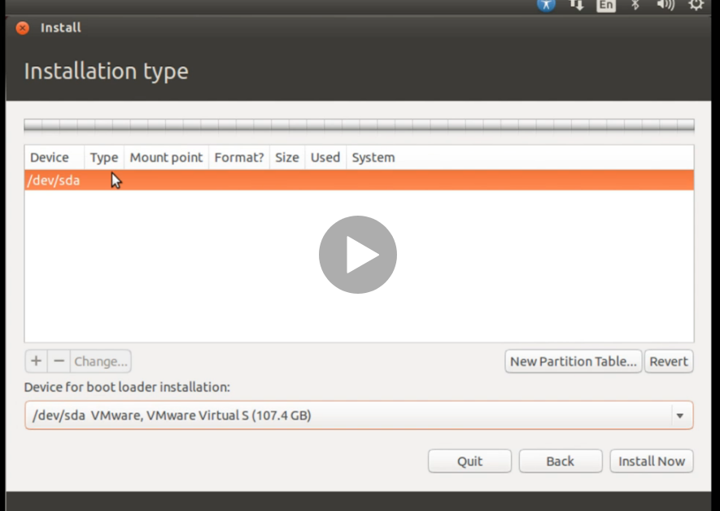
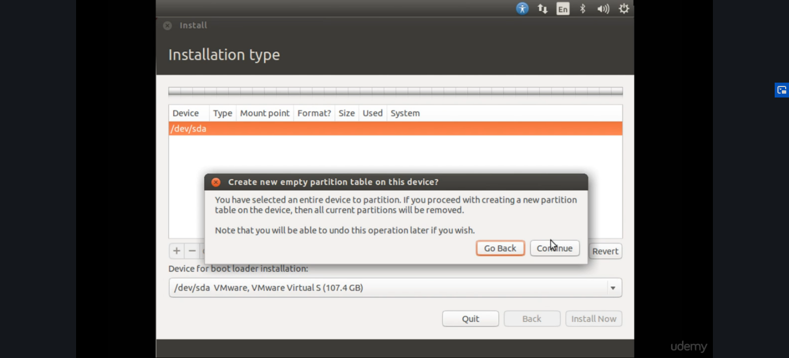
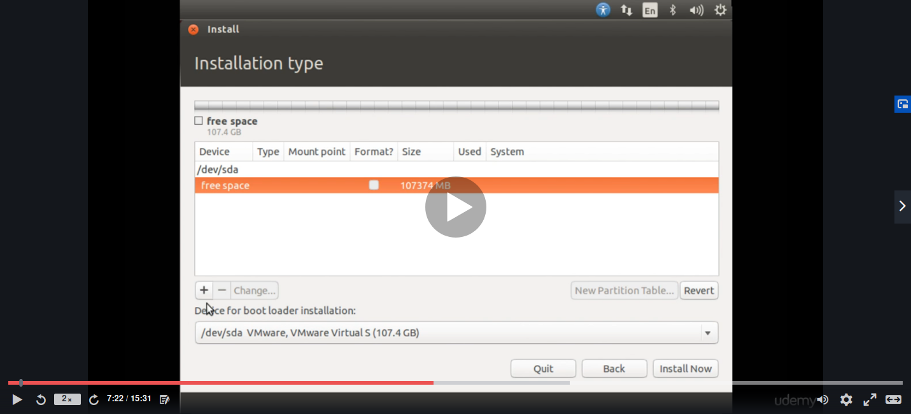
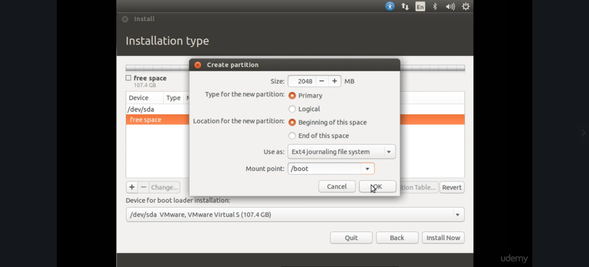
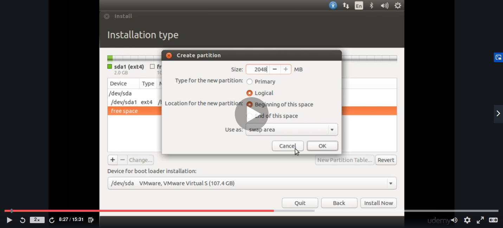
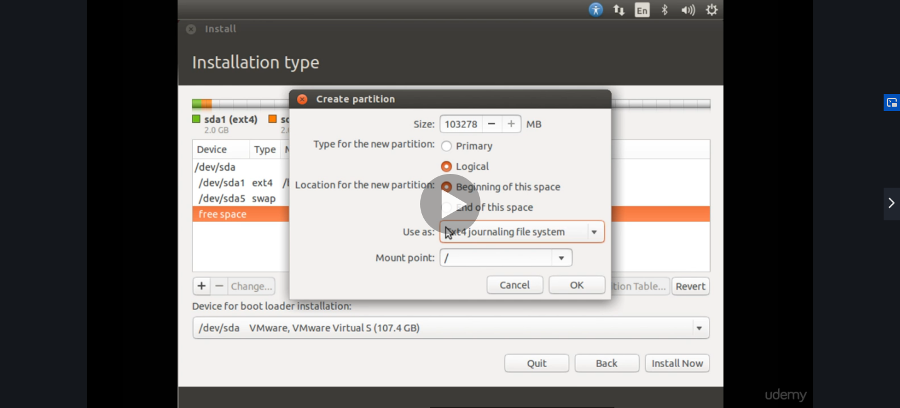

# Needed partitions
- Create partition table

- Select free space & then click on the + button 

## boot partition
- First create boot partition like this: 

## Swap partition
- Select free space & then click on the + button 
- Better to give 2x the amount of RAM size

## root partition
- Select free space & then click on the + button 
- Entire space can be given to root 

